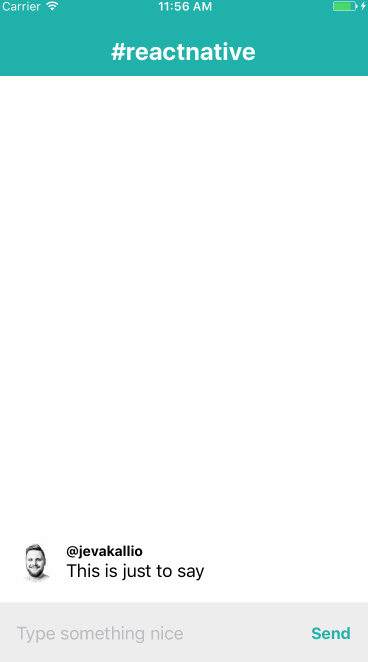

<h1>react-native-reversed-flat-list</h1>

<h4>
  A reversed React Native FlatList, useful for creating performant bottom-anchored lists for chats and whatnot
</h4>


***

## Documentation

Use exactly like you would use [FlatList](https://facebook.github.io/react-native/docs/flatlist.html).

```diff
- import {FlatList} from 'react-native';
+ import ReversedFlatList from 'react-native-reversed-flat-list';

const MessageList = ({ messages, renderMessage }) => (
-  <FlatList
+  <ReversedFlatList
    data={messages}
    renderItem={renderMessage}
  />
);
```

This component has not been tested with all the different options, bells and whistles of FlatList. If you hit a use case that doesn't work, please submit a Pull Request!

## How does it work

_aka. The One Weird Trick They Don't Want You To Know About Making Performant Reverse Lists in React Native_

I learned the basic mechanism from [expo/react-native-invertible-scroll-view](https://github.com/expo/react-native-invertible-scroll-view). The trick is to scale transform the FlatList's backing ScrollView to -1 in order to flip it on it's horizontal vertical axis, causing the list to look upside-down-mirrored. We then perform the same flip for each row within the list to turn them back the right way around. (To make it more natural to use the component with time-ordered datasets (oldest first), we also reverse the dataset.)

```js
const styles = StyleSheet.create({
  flip: {
    transform: [{ scaleY: -1 }]
  }
});
```

Surprisingly, this works well, fast and reliably.


## Attribution

- The flip transform trick [as far as I know](https://github.com/expo/react-native-invertible-scroll-view/commit/93b06f8c3e5a08d3c82f105784801b2f4aff65f9), by [@Satya164](https://github.com/Satya164). 
- Initial FlatList implementation prototyped by [@joshyhargreaves](https://github.com/joshyhargreaves).

## License

[MIT licensed](LICENSE)
